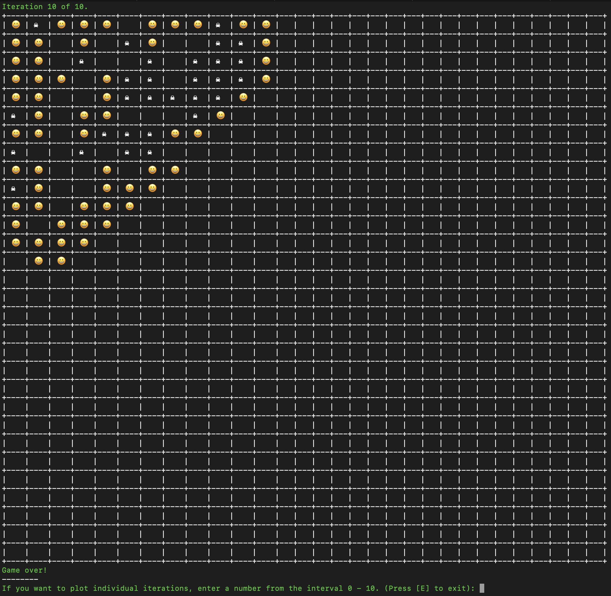

# Game of Life

PHP implementation of [Game of Life](https://en.wikipedia.org/wiki/Conway%27s_Game_of_Life).

This game serves as a sample implementation of some design patterns, design principles and data structures.

I wrote the game in two days so it will be full of bugs.



## How to run application

In the *bin* directory it will run command:

```
php game game:run -i input.xml
```

Parameter ```-i``` is optional, default value is ```input.xml```.

## Sample input

```xml
<?xml version="1.0"?>
<life>
    <world>
        <size>30</size> <!-- Dimension of the square "world" -->
        <iterations>10</iterations> <!-- Number of iterations to be calculated -->
    </world>
    <organisms>
        <organism>
            <x_pos>2</x_pos> <!-- x position -->
            <y_pos>0</y_pos> <!-- y position -->
        </organism>
        <organism>
            <x_pos>0</x_pos>
            <y_pos>1</y_pos>
        </organism>
        <organism>
            <x_pos>3</x_pos>
            <y_pos>1</y_pos>
        </organism>
        <organism>
            <x_pos>0</x_pos>
            <y_pos>2</y_pos>
        </organism>
        <organism>
            <x_pos>3</x_pos>
            <y_pos>2</y_pos>
        </organism>
        <organism>
            <x_pos>1</x_pos>
            <y_pos>3</y_pos>
        </organism>
    </organisms>
</life>
```

## How to run tests

Tests are written in PHPUnit.

```
composer test
```

## Iteration history

Once the life simulation is complete, the iteration history can be browsed. 

```
If you want to plot individual iterations, enter a number from the interval 0 - 10. (Press [E] to exit):
```